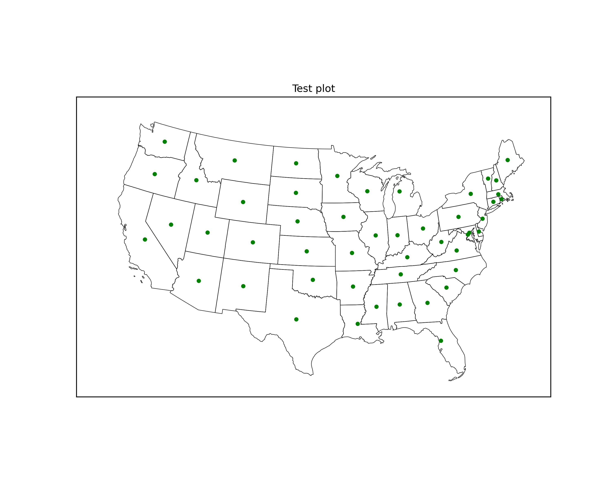
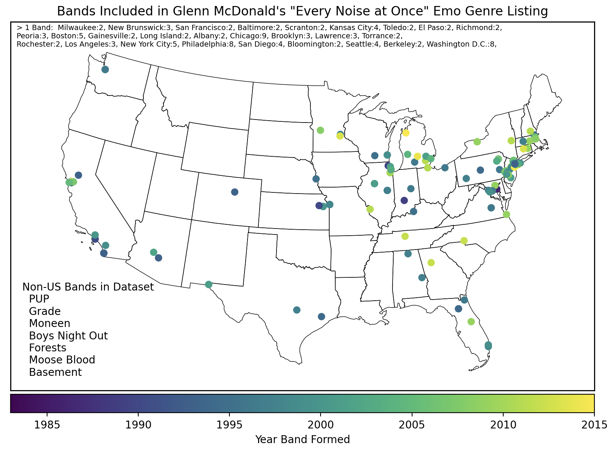
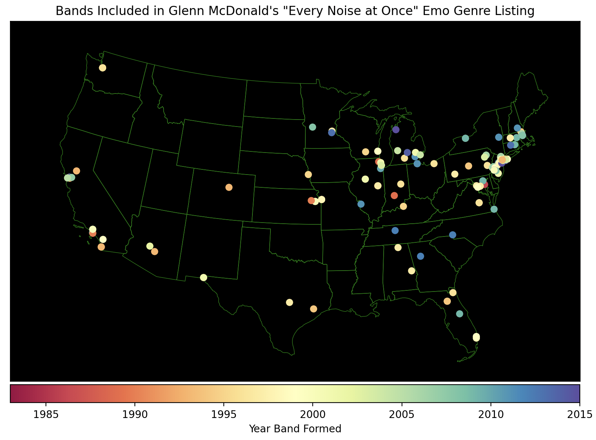
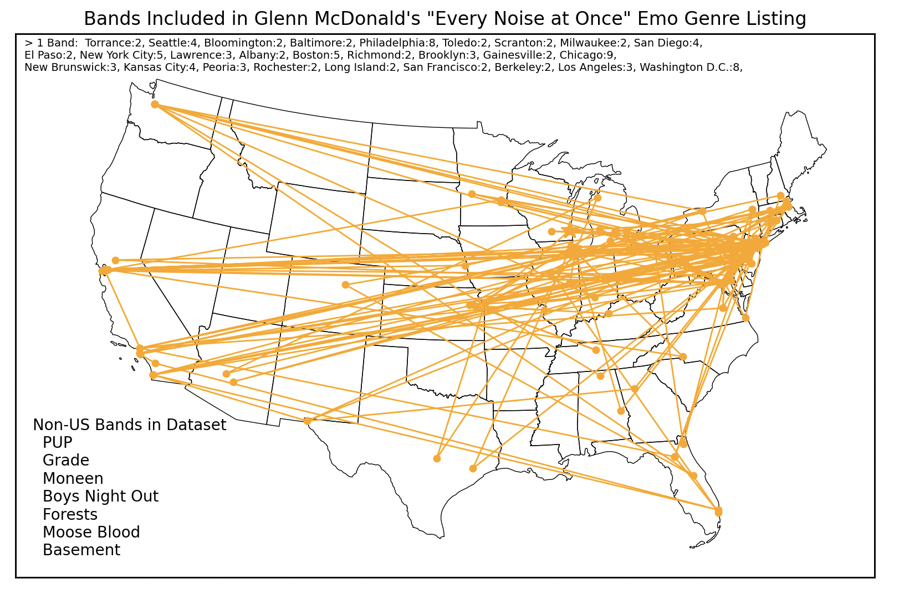

# Description
Public plotting scripts to reproduce graphs shared at EmoCon 2026.

# Installation
These instructions were written for GNU terminal (either a Mac or Linux OS, Windows will be similar)

First, clone the repo with your preferred method:
`git clone https://github.com/brallmond/EmoDataPlotting.git`

There are several python libraries that these scripts are built on top of.
If you use python regularly, it’s a good idea to containerize your projects using conda. If you already have that
installed, do:
```
conda install pandas
conda install matplotlib
conda install -c conda-forge basemap
```

If you don’t use python regularly, you can download these libraries directly with pip install
```
python3 -m pip install pandas
python3 -m pip install matplotlib
python3 -m pip install basemap
```

Some files from the US census bureau are necessary for this library to run, and cannot be included here
for copyright reasons. You can download them at the following link:
https://www.census.gov/geographies/mapping-files/time-series/geo/cartographic-boundary.html

I used 2024 at the time since 2025 was not yet released. The only content used in this library currently are state borders. 
Click on the word "shapefile" under the heading "20,000,000 (national)."
This downloads a zip file (`cb_2024_us_all_20m.zip`), which you should unzip in the directory `shapefiles`.

Your directory should look like this:
```
cb_2024_us_cd119_20m.zip    cb_2024_us_division_20m.zip cb_2024_us_region_20m.zip
cb_2024_us_all_20m.zip      cb_2024_us_county_20m.zip   cb_2024_us_metdiv_20m.zip   cb_2024_us_state_20m.zip
cb_2024_us_cbsa_20m.zip     cb_2024_us_csa_20m.zip      cb_2024_us_nation_20m.zip
```
Remove all files except `cb_2024_us_state_20m.zip`, then unzip this file.

Finally, an open-source library of U.S. city data is used to easily get longitudes and lattitudes. It is used under
Creative Commons (CC BY 4.0).
The basic version can be downloaded at: https://simplemaps.com/data/us-cities
And then copied to the main directory of this repo. 

Cities not in `uscities.py` were searched for manually using public databases and their name and location were added to
`missing_cities.py`.

With that, the following command should generate a test plot.
`python3 main.py`



# Technical Usage
To reproduce the plots from the presentation, simply run the individual scripts. The name of the script indicates the
dataset or datasets being used. You may need to open the scripts to inspect the details.

`python3 plot_emo_ENAO.py`


Some command line options are provided to change the basic styling of the background color, the state borders, the
dot color (for monocolor plots), and the color scale (for scatter plots). Note that the input csv must always be
provided manually in this mode.

`python3 plot_emo_ENAO.py --input_csv "ENAOData.csv" --color_bkgd "black" --color_border "green" --color_dot "purple"
--colorscale "Spectral"`


To produce a plot with your own dataset, copy and rename one of the existing plotting files, change the input data csv,
and change any related annotation inside the plotting script. For most cases this should be sufficient, but it could
also be necessary to add more locations to `missing_locations.py`.

A good place to start exploring the structure of this code is `plot_US_states_tutorial.py`, which has comments added to
the main functions used to produce scatter plots on a US map.

Many options and half-implemented features are present, have fun trying them out in `plot_blank_map.py`.



# Related Presentations
This library (v1.0) was used to generate all maps and plots shown in this presentation (except for slides 4 and 9): https://brallmond.github.io/pdfs/Emocon2026_BA.pdf

A map plot was also shared in this interview (csv intentionally not provided): https://swimintothesound.com/blog/2026/3/18/an-interview-but-its-midwest-emo-a-conversation-with-the-founders-of-emocon

# License / Limitations of Usage
This work uses two open-source copyright licenses with slightly different scopes. The plotting scripts interacting with
csv files are covered under the MIT license, meaning they can be used by anyone for any purpose. It's just python code.

The data csvs themselves are under the GNU GPLv3 license, which requires anyone making a modification to publish it
publicly under the same license. This is because the data is sourced from the works of others, with some interpretation,
and is readily obtainable on the internet. The original sources are
linked or referenced at the top of each data csv.

This licensing is intended to deter any non-research, for-profit entity from using the data csvs, and at least require
them to do their own legwork in generating the data. For researchers, you may freely use the data csvs, but if you
change or create your own data csv and use it within this framework--and the work eventually makes it to
publication--please fork a copy of this repository and upload a copy of your dataset to your copy of the repository. If
you include a plot in a published work made with this framework, please cite this repository in the plot caption, or directly on the figure.

If you are the original data owner and you would like these datasets removed, please understand their contents are being
used as part of a research project. What is taken from any work is the name of a band, and the fact it was mentioned in
that source. All other information (such as formation date, disbandment date, city of origin) 
is available and accessed via public websites such as Discogs and Wikipedia. In the case of listicles where album
/ single names are referred to, lists already exist on other user-sourced sites (Reddit, Spotify, RYM), which
I interpretted as tacit approval of their publication. If you disagree, please let me know and I will take them down.


